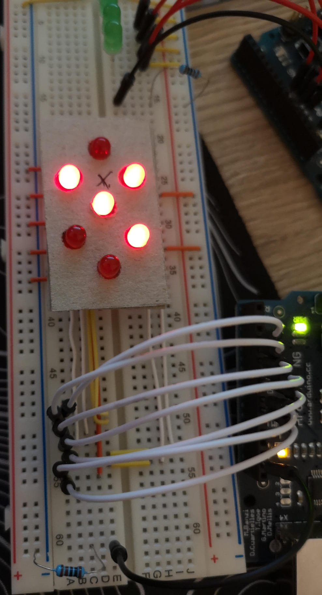

# C on an Arduino

I am learning C and embedded programming on my Arduino NG.

## Projects (in order of creation):
 - [fibonacci sequence](./fibonacci.c)
 - [binary counter](./binary_counter.c)
 - [counter on a single seven segment display](./seven_segment.c)

## Arduino

The Arduino is an Arduino NG with an ATMEGA8 for the microcontroller.

Specs:
 - 16MHz
 - 8Kbytes Flash memory
 - 1Kbyte SRAM

This is half the SRAM and a fourth the Flash memory of the ATmega328P, which is used in the Arduino UNO, but this is the smallest problem with using an Arduino this old. The biggest problem is the fact that there is not realy a lot of information available. The most helpfull were the [ATMEGA8 datasheet](https://ww1.microchip.com/downloads/en/DeviceDoc/Atmel-2486-8-bit-AVR-microcontroller-ATmega8_L_datasheet.pdf) and the [schematic of the Arduino board](https://www.arduino.cc/en/uploads/Main/arduino%5FNG%5Fschematic.png). 

Fun Fact:
I had to build my own seven segment display on a breadboard because i only had one and two of its LEDs were broken. I could have ordered new ones it would have taken a long time to ship and I didn't want to wait.

